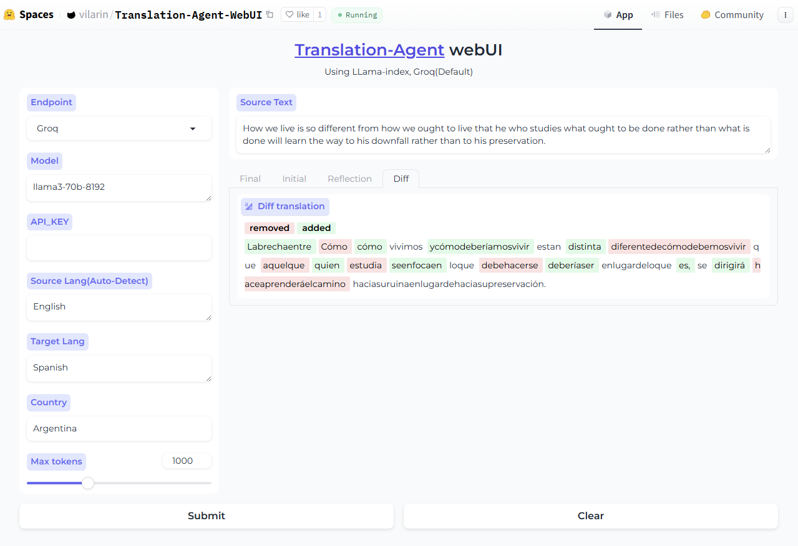

# translation-agent-webui
A gradio webui for Andrewyng

# Changelog
Now the modified App has been merged to [translation-agent App](https://github.com/snekkenull/translation-agent/tree/main/app)

LlaMax3 is an open-source model which collected extensive training sets in 102 languages, try it here. [LlaMAX3 version](https://huggingface.co/spaces/vilarin/LLaMAX3-Translator)

# Features
- Auto detect input text language
- Tokenized text words
- Highlight the difference between translations
- Support groq, openai, cohere, ollama, together AI, Huggingface Inference API (llama-index supported, easy to modify to add more api)

# Update
- You can use Huggingface Inference API now, enter the HF model ID in Model ,e.g. mistralai/Mistral-7B-Instruct-v0.3

# Preview

# Huggingface Space Demo
[vilarin/Translation-Agent-WebUI](https://huggingface.co/spaces/vilarin/Translation-Agent-WebUI)