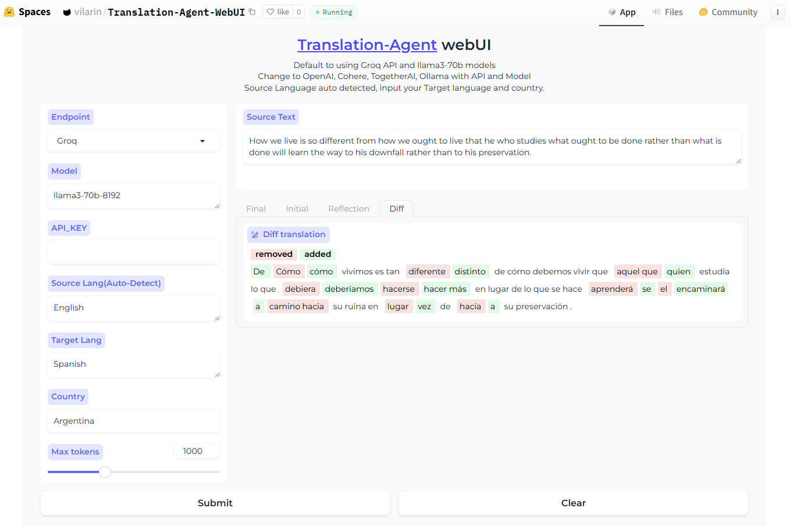

# translation-agent-webui
A gradio webui for Andrewyng's Translation Agent.

# Changelog
Now the official App has been merged to [translation-agent App](https://github.com/snekkenull/translation-agent/tree/main/app)

The official app uses an OpenAI compatible API (Instead of llama-index), resulting in fewer dependencies, a smaller size, and better suitability for local deployment (without polyglot, which caused errors in windows). 

However, some features have been removed, including Google Translate, enhanced automatic language detection, and the HuggingFace API. 

Please choose the version that best meets your needs.

BTW, another one based on the App is LlaMax3-Translation. LlamMax3 is an open-source model which collected extensive training sets in 102 languages, here it is [LlaMAX3 version](https://huggingface.co/spaces/vilarin/LLaMAX3-Translator) in Huggingface Spaces.

# Features
- Auto detect input text language
- Tokenized text words
- Highlight the difference between translations
- Support groq, openai, cohere, ollama, together AI, Huggingface Inference API (llama-index supported, easy to modify to add more api)

# Update
- You can use Huggingface Inference API now, enter the HF model ID in Model ,e.g. mistralai/Mistral-7B-Instruct-v0.3

# Preview

# Huggingface Space Demo
[vilarin/Translation-Agent-WebUI](https://huggingface.co/spaces/vilarin/Translation-Agent-WebUI)
